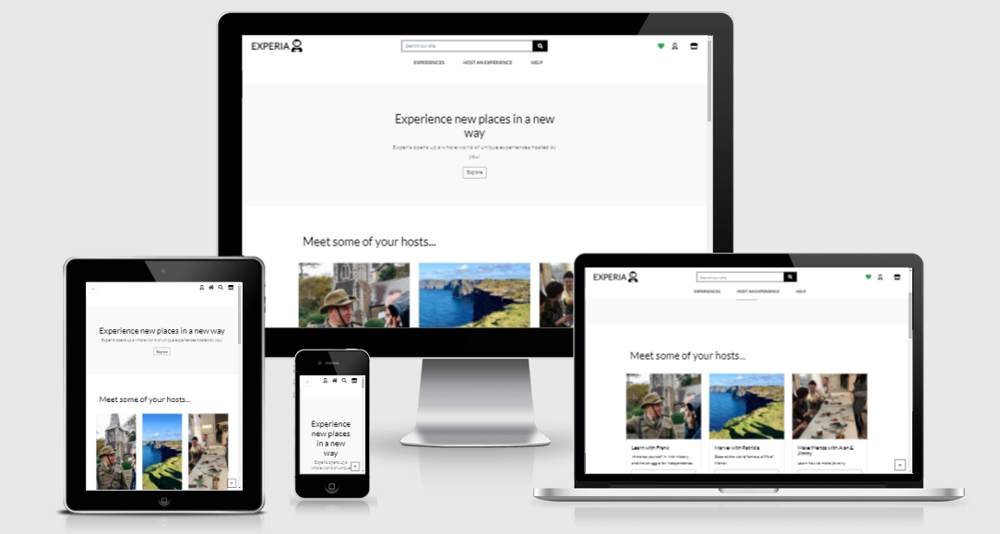

# EXPERIA - The unique experience platform.


[View Experia live here.](https://experia-app.herokuapp.com/)





## Overview & Objective
Experia is a web application that allows account holders to browse and buy unique experiences. Account holders also have the option of creating and managing their own experiences that they can sell on the website. 

This Website was created for the purpose of implementing a fullstack Django framework website with Stripe payment integration.
The project allows users to explore a range of different experiences, purchase them, and also create their own unique experiences available for purchase. The website was built using Bootsrap (HTML, CSS), JS, Python, Django, Stripe, AWS S3.

#### Ideation
The concept for Experia came from my own experiences travelling, I found sometimes it would be hard to find things to do in some cities or I was not interested in what was on offer.

## UX & Design

### Strategy
#### Target Audience
- Tourists.
- City break enthusiasts. 
- People who want to try interesting and alternative experiences.
- People who have a unique talent, knowledge or skill and want to monetize it.

#### Project Goal
##### Personal
The personal goal for this project is to give me experience building a full stack e-Commerce website that handles payments.
##### Business 
The commercial goal or 'use case' of the website is to act as a platform where people can browse and purchase unique experiences in their own city or perhaps a city that they plan on visiting. There is also an option for a user to create their own unique experiences which they can make available for purchase.

### Project scope
For the project to succeed in accomplishing it's objectives, a clear rule set must be established to keep the project on track. Mostly these objectives and features are tied in with the user stories and their goals. 

- #### Define the project
  - Connect objectives with creative strategies
- #### Project tasks
  - Preparing the build
  - Information Architecture - database design
  - Feature driven development - host, wishlist, profile, reviews.
- #### Review
  - Get feedback on design ideas and feature list
- #### Build
  - Commence build
  - Continiously review, whats working and what is not

#### Site owner goals
- Have the skills to build a full stack e-Commerce website
- Make the website design user-friendly
- Make the website accessible for all
- Retain users and create recurring visits

#### User goals
- Ease of use
- Ease of navigation
- Ease of purchase
- Satisfaction
- Informative feedback
- Consistant features


## User Experience (UX)

-   ### User stories


|                              | As a:          | I want to be able to:                                     | So that I can:                                                                                              |   |   |
|------------------------------|----------------|-----------------------------------------------------------|-------------------------------------------------------------------------------------------------------------|---|---|
|        View & navigate       |                |                                                           |                                                                                                             |   |   |
|                            1 | Customer       | View available products/service                           | Select ones to purchase                                                                                     |   |   |
|                            2 | Customer       | View products/service details                             | Identify, price, description, rating, availability, image                                                   |   |   |
|                            3 | Customer       | Identify products/service deals, special offers           | Purchase product/service(s) at a discount                                                                   |   |   |
|                            4 | Customer       | View my total spend at any time                           | Prioritise budget and stay generally informed                                                               |   |   |
| Registration & user accounts |                |                                                           |                                                                                                             |   |   |
|                            5 | Site browser   | Register for an account                                   | Have a personal account and view my profile                                                                 |   |   |
|                            6 | Site browser   | Login and logout                                          | Access my personal account info                                                                             |   |   |
|                            7 | Site browser   | Recover password if forgotten/lost/corrupted              | Recover access to my account                                                                                |   |   |
|                            8 | Site browser   | Receive email confirmation after registration             | Securely verify my account using personal email                                                             |   |   |
|                            9 | Site browser   | Have a personalised user profile                          | View order history, current orders and payment information                                                  |   |   |
|      Host an experience      |                |                                                           |                                                                                                             |   |   |
|                           10 | Account holder | Create an experiece                                       | Offer my own unique experience                                                                              |   |   |
|                           11 | Account holder | Host it on the website                                    | People can purchase the experience                                                                          |   |   |
|      Sorting & searching     |                |                                                           |                                                                                                             |   |   |
|                           12 | Customer       | Sort list of available products                           | Identify best rated, best priced and categorically sorted products                                          |   |   |
|                           13 | Customer       | Sort category of product                                  | Find best-price, best-rated product in a category or sort product by name                                   |   |   |
|                           14 | Customer       | Sort multiple categories simultaneously                   | Find best-price, best-rated product in a category or sort product by name across categories such as 'Tours' |   |   |
|                           15 | Customer       | Search for product by name or description                 | Find a specific product I'd like to purchase                                                                |   |   |
|                           16 | Customer       | See what I've searched and number of results              | Find out if a product I want is available                                                                   |   |   |
|                           17 | Account holder | Make a wish list                                          | Save products I may wish to purchase in the future                                                          |   |   |
|      Purchase & checkout     |                |                                                           |                                                                                                             |   |   |
|                           18 | Customer       | Easily select and quantity of product/service             | Avoid purchasing the wrong product, quantity                                                                |   |   |
|                           19 | Customer       | View items in shopping bag                                | Identify total cost of my purchase                                                                          |   |   |
|                           20 | Customer       | Adjust date, time and quantity of product in shopping bag | Easily make changes to my order on the fly                                                                  |   |   |
|                           21 | Customer       | Easily enter my payment information                       | Check out quickly and with no hassle                                                                        |   |   |
|                           22 | Customer       | Feel that my payment information is processed safely      | Pay with confidence                                                                                         |   |   |
|                           23 | Customer       | View an order confirmation after checkout                 | Check that what I purchased is correct and view details                                                     |   |   |
|                           24 | Customer       | Receive an email confirmation after check out             | Keep for my records                                                                                         |   |   |
|   Admin & store management   |                |                                                           |                                                                                                             |   |   |
|                           25 | Site Owner     | Add a product                                             | Add new experiences to the store                                                                            |   |   |
|                           26 | Site Owner     | Edit/update a product                                     | Change experience prices, descriptions, images etc.                                                         |   |   |
|                           27 | Site Owner     | Delete a product                                          | Remove experiences that are no longer for sale                                                              |   |   |
|                           28 | Site Owner     | Edit/update a review                                      | Review a particular experience                                                                              |   |   |
|                           29 | Site Owner     | Delete a review                                           | Delete a review that may be offensive or against the terms of the site                                      |   |   |


### Project Structure

This project, where possible makes use of DRY (Dont repeat yourself) principles with the use of OOP classes, functions and Django templating language.
The core static (HTML, CSS) files `Base.html` and `Base.css` include the `main-nav.html` and `mobile-top-header.html` of which, all other HTML pages on the website inherit from with the use of extended block content.
The nature of Django's app components allows functionality to be tagged on in stages, this separation also makes for a cleaner and more readable development process. 

## Database backend design schema

This project makes use of a number of database tables or 'Models' as they are called in Django.
Django supports various databases, for this project the database chosen while in development was SQLite. When the project was deployed to Heroku the database was migrated and provisioned to PostgreSQL.

#### User model

One of the advantages of using Django is the ability to use 'out of the box' functionality, Django takes care of user authentication with its default configuration `django.contrib.auth.models`.
When setting up the project it is also a good time to create a superuser, this is achieved with the below command line entry and gives access to all site administration.
 - `$ python manage.py createsuperuser --username=joe --email=joe@example.com`

The primary attributes of the default user are:
|  User 'id' |
|------------|
| username   |
| password   |
| email      |
| first_name |
| last_name  |

#### Home app

- Path: /home
- Models: This app does not require a database table.
- Stores the account user's basic details.

#### Experiences app

- Path: /experiences
- Models: `Experiences` and `ExperienceCategory`
- `Experiences` stores the details associated with each experience with foreign keys connecting to other tables.
- `ExperienceCategory` stores the category of the experience.

| Experiences (id)    | PK           |
|---------------------|--------------|
| created_by          | FK(UserProfile)           |
| experience_category | FK(ExperienceCategory)           |
| name                | charfield    |
| description         | textfield    |
| location            | charfield    |
| price               | decimalfield |
| duration            | charfield    |
| age_restricted      | booleanfield |
| language_default    | booleanfield |
| image               | imagefield   |
| rating              | decimalfield |
| hosted_by           | charfield    |

| ExperienceCategory (id) | PK        |
|-------------------------|-----------|
| name                    | charfield |
| friendly_name           | charfield |


#### Bag app

- Path: /bag
- Models: This app does not require a database table. Instead, uses a context processor that stores the bag contents in session.


#### Checkout app

- /checkout
- Models: `Order` and `OrderLineItem`
- `Order` stores the information associated with a particular order.
- `OrderLineItem` stores details of each experience that is added to the order.

| Order (id)      | PK              |
|-----------------|-----------------|
| order_number    | charfield       |
| user_profile    | FK(UserProfile) |
| full_name       | charfield       |
| email           | emailfield      |
| phone_number    | charfield       |
| country         | countryfield   |
| postcode        | charfield       |
| town_or_city    | charfield       |
| street_address1 | charfield       |
| street_address2 | charfield       |
| county          | charfield       |
| date            | datefield       |
| order_total     | decimalfield    |
| grand_total     | decimalfield    |
| original_bag    | textfield       |
| stripe_pid      | charfield       |


| OrderLineItem (id) | PK              |
|--------------------|-----------------|
| order              | FK(Order)       |
| experience         | FK(Experiences) |
| quantity           | integerfield    |
| lineitem_total     | decimalfield    |


#### Help app

- Path: /help
- Models: This app does not require a database table.


#### Host app

- Path: /host
- Models: `PostExperienceView` inherits from `Experiences` table.
- This app modifes the Experiences model with the users created experience via a form.

#### Profiles app

- Path: /profiles
- Models: `UserProfile`
- `UserProfile` stores the users profile billing details. 

| UserProfile (id)        | PK                  |
|-------------------------|---------------------|
| user                    | onetoonefield(User) |
| default_phone_number    | charfield           |
| default_street_address1 | charfield           |
| default_street_address2 | charfield           |
| default_town_or_city    | charfield           |
| default_county          | charfield           |
| default_country         | countryfield        |
| defualt_postcode        | charfield           |


#### Wishlist

- Path: /wishlist
- Models: `Wishlist` and `WishlistItem`
- `Wishlist` Model to show all product items within the users wishlist.
- `WishlistItem` A 'through' model allowing users to add
    individual products to their favourites.

| Wishlist(id) | PK                           |
|--------------|------------------------------|
| user         | oneotonefield(User)          |
| experiences  | manytomanyfield(Experiences) |

| WishlistItem(id) | PK              |
|------------------|-----------------|
| experience       | FK(Experiences) |
| wish             | FK(Wishlist)    |


## Presentation frontend structure

#### Home

- Template: `index-new.html`
- This is the landing page of the website, it is laid out in a modern and intuitive way, the user is greeted with a banner message and call to action button to explore, the user is encouraged to scroll further down to
the 'Meet your host' section which has links directly to those experiences. Below that again is another container highlighting the commitment to quality. Finally below that are customer testimonials, a contact us form and the footer rich with useful links. This page also features a Modal that pops up on page load to inform the user of the sites cookie policy, when the user accepts, it stores a boolean variable in session and the cookie pop up will not appear again. 

#### Experiences

- Template: `experiences.html` and `experiences_detail.html`
- `experiences.html` shows the entire collection of experiences available to view and purchase. There is a dropdown in the top right of the screen to filter experiences by various criteria. On each experience card image there is a heart that allows an account user to quick add an experience to their wishlist. 
- `experiences_detail.html` shows a more detailed page of the individual experience, from here the user has a host of options, they can add a review and rating of the experience, they can add it to their wishlist, or they can select how many guests they would like to attend the experince and select the add to bag option.

#### Bag

- Template: `bag.html`
- `bag.html` shows the customers session stored items for purchase, here they can view, amend or delete items before proceeding to checkout.

#### Checkout

- Template: `checkout.html` and `checkout_success.html`
- `checkout.html` shows the last step in the sales cycle for the user, on the left they have in input form where they enter their personal details and card number. On the right,
they are shown an order summary of the experinces they are buying and the cost. 
- `checkout_success.html` Onve the order has completed they are directed to this page where they are informed that their order is complete and will receive an email confirming it.

#### Help

- Template: `help.html` and `contact-us.html`
- `help.html` shows the sites general terms and conditions, a user can also be guided here if they click on the link from the landing page cookie policy.
- `contact-us.html` features a contact, address with Google map iframe, and general FAQ accordion section.

#### Host

- Template: `host.html` and `update_experience.html`
- `host.html` on the left features a form connected to the Experiences model that allows the user to create their own unique experience. On the right, shows the experiences the user has created and allows them to manage these experiences with update or delete features.
- `update_experience.html` a user is brought here when they select the edit button on their specific experience. It shows a prepopulated form with the existing data, the user can adjust any part of the experience and save to update the experience. 

#### Profiles

- Template: `profile.html`
- This page shows the users default information that has been stored from any previous purchases (if selected), on the right they also have an order history list. 

#### Wishlist

- Template: `wishlist.html`
- This page shows a detailed description of the user's saved wishlist items. They can remove these by simply clicking the remove button.


## Surface Design
-   #### Colour Scheme
    -   The two main colours used white and slate grey. I believe they give the cleanest appearance and make the important details standout easily to the user.
    - rgb(65, 64, 64);
-   #### Typography
    -   The Lato font family imported from Google fonts is the main font used throughout the website with Sans Serif as the default fallback. Lato is a clean, clear font that 
    is easy to readon all viewports.
-   #### Imagery
    -   Imagery is an essential and expected part of any modern website. They help draw the user in and help them make decisions faster.
-   #### Iconography
    - There has been a lot of consideration to the use of icons throughout the website. Since the idea stage the theme of the site has been about exploration hence the reason for the Astronaut icon used throughout.
    - The heart icon has also been used extensively, as a website user this is generally known to be a way of liking or favouriting something. This is the reason it was chosen as the way to add an experience to the users wishlist. 

### Wireframes

-   Home Page Wireframe - [View](README/landing.pdf)

-   Profile Wireframe - [View](README/profile.pdf)

-   All Experiences Wireframe - [View](README/all%20experiences.pdf)

-   Experiences Wireframe - [View](README/experiences.pdf)

-   Experiences Detail Wireframe - [View](README/experiences%20detail.pdf)

-   Host Wireframe - [View](README/host.pdf)

-   Checkout Wireframe - [View](README/checkout.pdf)


### Features
-   Responsive on all device sizes
-   Interactive elements
### Stand out features
- Wishlist - add interesting experiences to your personal wishlist
- Experience detail reviews - leave a review and rating about a certain experience to let others know what it was like
- Host an experience option - Create and manage your own unique experience that anybody can purchase and enjoy

## Technologies Used

### Languages Used

- [HTML5](https://html.com/html5/)
- [CSS3](https://developer.mozilla.org/en-US/docs/Web/CSS)
- [JavaScript](https://developer.mozilla.org/en-US/docs/Web/JavaScript)
- [Python](https://www.python.org/)

#### Frameworks and Libraries
- [Django](https://www.djangoproject.com/) - Used as the main framework for this site.
- [Google Fonts](https://fonts.google.com/) - Used for the typography of the site.
- [Font Awesome](https://fontawesome.com/) - Used for the icons of the site.
- [Bootstrap](https://getbootstrap.com/) - Used for the styling of the site.
- [jQuery](https://jquery.com/) - Used instead of Vanilla JS.

#### Database
- [SQLite](https://www.sqlite.org/) - Used for the development database of the site.
- [PostgreSQL](https://www.postgresql.org/) - Used for the Deployed database of the site on Heroku.

#### Cloud service
- [Heroku](https://www.heroku.com/) - Used for the deployment of the site.
- [AWS](https://aws.amazon.com/) - S3 bucket used for hosting media images and static files.

#### Version control
- [Git](https://git-scm.com/) - Used for the version control of the site.
- [GitHub](https://github.com/) - Repository for storing the project files.

#### IDE
- [Gitpod](https://gitpod.io/) - IDE used for the development of the site.
- [VS Code](https://code.visualstudio.com/) - IDE used for the development of the site.

#### Wireframing + Designing
- [Balsamiq](https://www.balsamiq.com/) - Used for the wireframes.
- [Google Sheets](https://www.balsamiq.com/) - Used for designing user stories and database.
- [Table markdown](https://www.tablesgenerator.com/) - Used for presenting database tables.

#### Testing
- [Lighthouse](https://developers.google.com/web/tools/lighthouse) - Tool for measuring the quality of web pages.
- [PEP8 Markup Validator](http://pep8online.com/) Python PEP8 validator
- [W3C Markup Validator](https://jigsaw.w3.org/css-validator/#validate_by_input) CSS validator
- [W3C CSS Validator](https://jigsaw.w3.org/css-validator/#validate_by_input) HTML validator
- [Temp Mail](https://temp-mail.org/en/) Anonymous email to test email sending


## Testing

Testing documentation can be found [**here!**](TESTING.md)


## Deployment

The deployment of the website was a two stage process, first part was hooking up the project to Heroku which enables developers to build, run, and operate applications entirely in the cloud.
Secondly, configuration of an Amazon Web Services (AWS) S3 bucket to store the static and image media files.

#### Heroku 

1. Navigate to Heroku website.
1. Create or login to existing account.
1. Create a new app with unique, relevant name.
1. Choose the region closest to you geographically and click 'Create app'.
1. When created, click on "Resources" tab to add the PostgreSQL database. Type in "Heroku Postgres" and select it This will create a DATABASE_URL variable in the config vars in settings.
- [Enable automatic deployments]
1. Click on 'Deployment' tab.
1. Click the option for 'GitHub' and search for the project repository.
1. Click on the option for enabling automatic deployments.
- [Install DB config packages]
1. In the IDE `pip install dj_database_url` and `psycopg2-binary` to configure the PostgreSQL database.
1. In settings.py add: 
    `DATABASES = {
    "default": dj_database_url.parse("database_url")
}`
1. Comment-out the existing SQLite3 database.
1. Access Heroku via the Heroku CLI `heroku login -i`
1. Migrate models, fixtures etc to the Postgres database.
1. Run:
    - heroku run python manage.py makemigrations --dry-run
    - heroku run python manage.py makemigrations
    - heroku run python manage.py migrate --plan
    - heroku run python manage.py migrate
1. Install the gunicorn package by typing `pip install gunicorn`
1. Freeze the requirements file by typing `pip3 freeze > requirements.txt`
1. Create a project level `Procfile` in the CLI `touch Procfile`

Heroku config variables are set in the following way:

|          Key          |          Value         |
|:---------------------:|:----------------------:|
| AWS_ACCESS_KEY_ID     | aws_access_key         |
| AWS_SECRET_ACCESS_KEY | aws_secret_access_key  |
| DATABASE_URL          | auto-generated         |
| EMAIL_HOST_PASS       | email_pass_key              |
| EMAIL_HOST_USER       | email_address             |
| SECRET_KEY            | secret_key             |
| STRIPE_PUBLIC_KEY     | stripe_public_key |
| STRIPE_SECRET_KEY     | stripe_secret_key |
| STRIPE_WH_SECRET      | stripe_webhook_key     |
| USE_AWS               | True                   |


#### AWS S3

### Setting up an AWS S3 bucket

1. Create or login to existing AWS account.
1. After login, navigate to S3 and create bucket.
1. Name the bucket as you did for the Heroku app name.
1. Navigate to the 'Block public access' part and uncheck 'Block public access'. Confirm and scroll to click 'Create bucket'.

### Bucket properties

1. Navigate to properties tab, scroll to end and click the 'edit' button.
1. Choose 'Enable' static website hosting.
1. Select 'Host static website', scroll to 'Documents inputs'.
1. In the field, enter the 'index.html' and 'error.html'.
1. Leave redirect empty and save changes.

### Permissions

1. Navigate to permissions tab. Scroll to bottom of page and click edit 'Cross-Origin Resource Sharing (CORS)" section'.
1. Enter the following JSON config:
```
[{
  "AllowedHeaders": ["
  Authorization"
  ],
  "AllowedMethods": [
    "Get"
    ],
  "AllowedOrigins": [
    "*"
    ],
  "ExposeHeaders": [],
}]
```
1. Save changes and go to 'Bucket policy', click edit. 

### Bucket Policy

1. Go to 'Policy Generator', select 'S3 Bucket Policy' from dropdown.
1. Allow permissions:
  - Effect = Allow
  - Principle = *
  - Actions = GetObject, GetObjectAcl, PutObject, PutObjectAcl and DeleteObject
  - Amazon Resource Name =  under "Bucket ARN". Paste it into this box
1. Click add statment and generate policy
1. Copy the policy over into the bucket with '/*' on the end for all and save.

### ACL - Access Control List

1. Navigate to permissions tab and edit ACL section
1. Find 'Everyone (public access)' and select the box under the Objects header. Accept and save.

### IAM - Group with policy

1. In the search bar input 'IAM' where a goup policy will be set up.
1. In 'Access Management' choose 'User Groups' and create a group.
1. Name the group accordingly with the bucket and create.
1. At the IAM dashboard go to policies.
1. Create policy and click on the JSON tab to import the managed policy.
1. Copy accross the ARN like the below and select create:

```
{
    "Version": "2012-10-17",
    "Statement": [
        {
            "Effect": "Allow",
            "Action": [
                "s3:*",
            ],
            "Resource": [
                "arn:aws:s3:::YOUR-ARN",
                "arn:aws:s3:::YOUR-ARN/*"
            ]
        }
    ]
}
```

### Attach group policy

1. In 'User groups' - 'Access Management', click on the new group and go to the 'Permissions' tab
1. Attach the policy.
1. Go to the policy you have just created, then Select "Add Permissions".

### IAM User

1. Navigate back to IAM and click on Add new user.
1. Give permission to the user then choose 'Next - Permissions'
1. Choose the group to put the user into, continue until the user is created.
1. Download csv file containing Access Key and Secret Access Key.

These Keys must be added to environment variables in the project level settings.py file as follows:

```
if 'USE_AWS' in os.environ:
    AWS_STORAGE_BUCKET_NAME = 'bucket_name'
    AWS_S3_REGION_NAME = 'region'
    AWS_ACCESS_KEY_ID = os.environ.get('AWS_ACCESS_KEY_ID')
    AWS_SECRET_ACCESS_KEY = os.environ.get('AWS_SECRET_ACCESS_KEY')
    AWS_S3_CUSTOM_DOMAIN = f'{AWS_STORAGE_BUCKET_NAME}.s3.amazonaws.com'
```

## Deploying the project locally
The below is a step-by-step guide on how to deploy Experia in your local environment.

### Requirements
- VSCode or similar IDE
- Python - version at the time of writing is v4.01
- PIP package manager
- Stripe

#### Deployment steps
1. In GitHub, clone a copy of the Experia repository by navigating to the top of the Experia page and select the 'Code' dropdown button, while there select 'Download zip' and extract to a folder on your machine.
This may also be done by running the below command in the terminal:
`git clone https://github.com/devgithubs/experia.git`

1. Open the IDE of your choice
1. Set up a virtual environment to keep all packages within state. Run the comand:
`pip install pipenv`
1. In the root directory create a new folder named '.venv'
1. To launch the virtual environment run the below command:
`[sourcefolder]\scripts\activate\activate.bat`
1. To recursively install all the necessary packages that the project depends on, run this command:
`pipenv install -r requirements.txt`
1. Create a folder in the root directory called env.py. Inside this file add the following environment variables:
```
import os

os.environ["SECRET_KEY"] = "[Your Secret Key]"
os.environ["DEV"] = "1"
os.environ["HOSTNAME"] = "0.0.0.0"
os.environ["STRIPE_PUBLIC_KEY"] = "[Your Stripe Key]"
os.environ["STRIPE_SECRET_KEY"] = "[Your Stripe Secret Key]"
os.environ["DATABASE_URL"] = "[Your DB URL]"
```

#### Database Provisioning
- To set up your database the below migration command must be run:
`python manage.py migrate`
- Next, create a superuser to access the Django admin panel, do this by running:
`python manage.py createsuperuser`
- You can then spin up your server by running the command:
`python manage.py runserver`
- If everything has been set correctly you should be prompted to run your the site locally on port 8000
- Interrupt the server by typing ctrl+c and add these fixture files:
```
python manage.py loaddata fixtures/categories.json
python manage.py loaddata fixtures/experiences.json
```

## Further Development
- Develop Experia contact email to handle customer/user queries
- Manual/Automated reviews of user created experiences to ensure they meet general guidlines on code of conduct
- Date and Time selection - Implement a booking timetable of available experiences based on the hosts schedule, so both the customer and the host know experience availability and demand.
- Additional functionality and customisation with regards to defensive programming. Confirmation modals on delete functions.
- Analytics
- Domain hosting

## Credits

### Content
The text and image data that was loaded via the fixture files was sourced but not limited to

- [Airbnb Experiences](https://www.airbnb.ie/s/experiences)

### References

- Code Institute - Code adapted from the Boutique Ado follow along project with regard to app views, forms and templating
- Bootstrap - Components used throughout the project and to create the Index page 
- [MDB](https://mdbootstrap.com/docs/standard/navigation/footer/) For custom footer
- [Start Bootstrap](https://startbootstrap.com/template/business-frontpage) Elements of the landing page

### Acknowledgements
- Code Institute - Tutor support team
- Mentor - [Richard Wells](https://github.com/D0nni387/)