# Experia Testing
This README details the steps taken to stress test and validate the Experia project

 

## Journey of a typical Experia user

### First time user - User B
- Lands on the website and sees an experience of interest
- Signs up for an account
- Browses to and finds an experience they would like to purchase
- Proceedes to checkout

### Return user - User A
- Admin
- Host 
Like user B, a Host user will return to the site on many occasions to manage their created experience(s), check admin and other fetures.

## Security
The website relies on Django's default security features
### Cross site request forgery (CSRF) protection
- Django has built-in protection against most types of CSRF attacks, providing you have enabled and used it where appropriate.
- CSRF is used to secure all of the forms and anywhere the user interacts with the applications database.
- Certain views and functionality within the app are also limited to authenticated or superuser accounts.
- These views are secured with the The [login_required](https://docs.djangoproject.com/en/4.0/topics/auth/default/#the-login-required-decorator) decorator. If the user isn’t logged in, they are redirect to the login page.

## Validation Testing
Below is a matrix of validation tests carried out on the project.

| HTML                 |   | PEP8       |   | CSS            |   |
|----------------------|---|------------|---|----------------|---|
| Index                | ✔ | See report | ✔ | See W3C report | ✔ |
| Experiences          | ✔ |            |   |                |   |
| Experiences_Detail   | ✔ |            |   |                |   |
| Host_Experience      | ✔ |            |   |                |   |
| Edit_Host_Experience | ✔ |            |   |                |   |
| Terms & Conditions   | ✔ |            |   |                |   |
| Contact              | ✔ |            |   |                |   |
| Wishlist             | ✔ |            |   |                |   |
| Profile              | ✔ |            |   |                |   |
| Bag                  | ✔ |            |   |                |   |

### HTML
All HTML validation was run through [W3C](https://validator.w3.org/)
Warnings were ignored.
- Landing page - 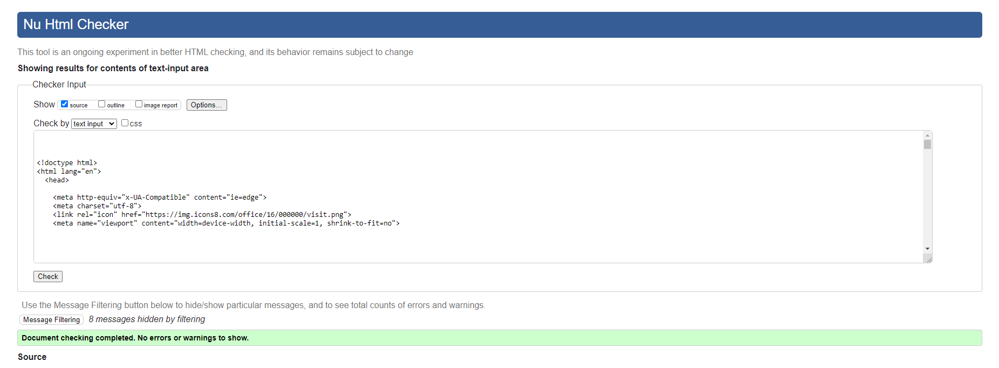
- Profile page - 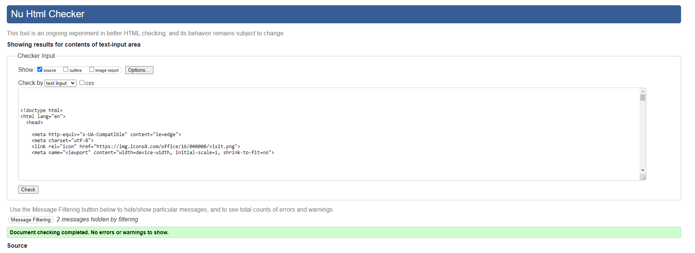
- Wishlist page - 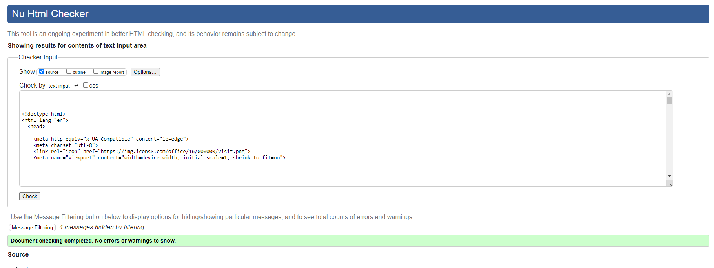
- Terms & Conditions page - 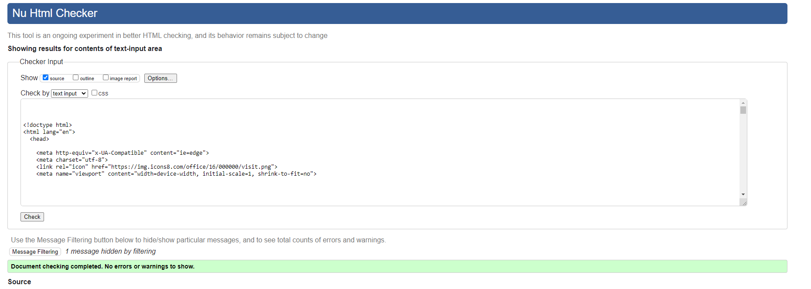
- Host Experience page - 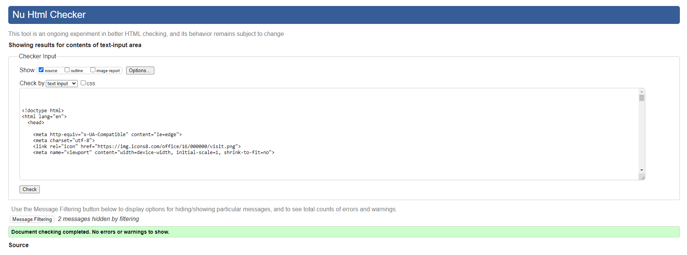
- Edit Host Experience page - 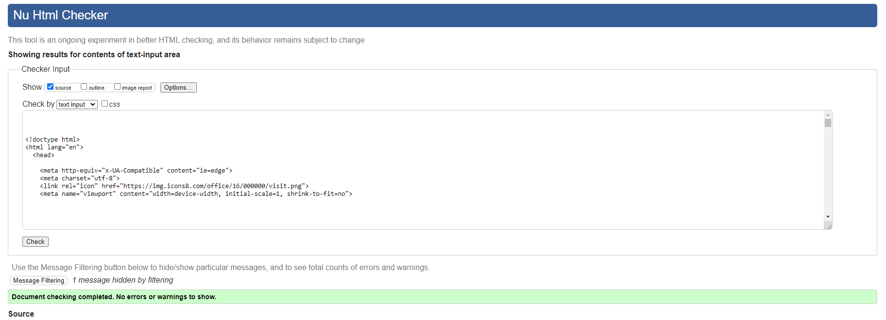
- Experiences page - 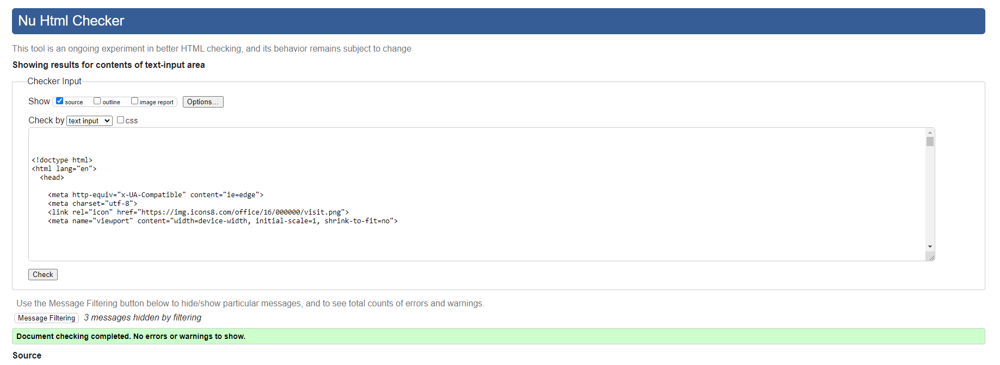
- Experiences Detail page - 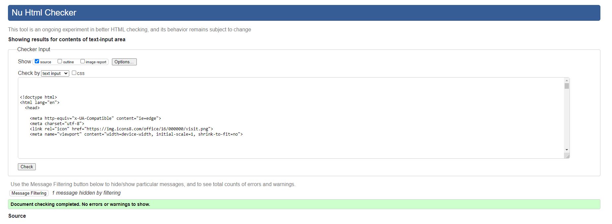
- Contact page - 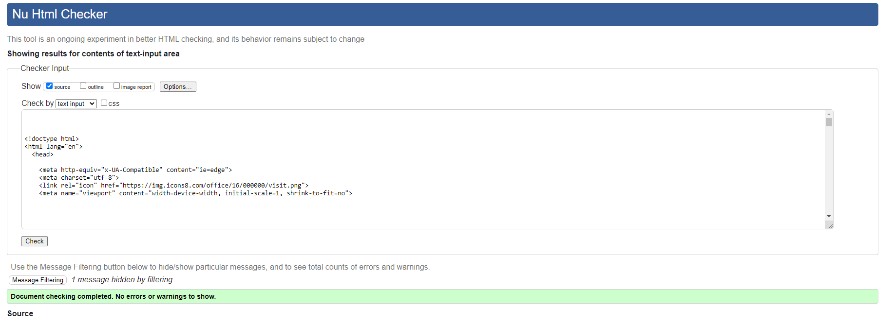
- Bag page - 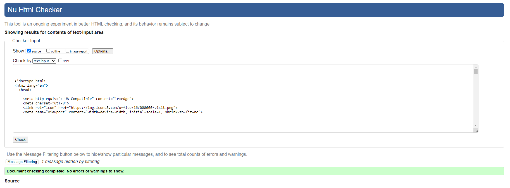
- Contact page - 

### CSS
All CSS validation was run through [W3C CSS](https://jigsaw.w3.org/css-validator/)
Warnings were ignored.
- 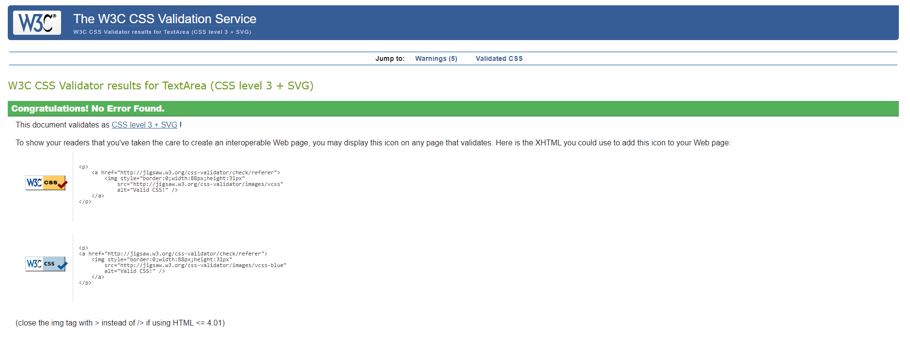

### Python
#### PEP8
- Below is a detailed PEP8 report generated by running `$ python3 -m flake8` in the terminal on the complete code base.
- All linting issues were reviewed individually - import, whitespace, docstring, indentation, line-too-long were rectified where possible.
- It was determined that in cases where linting issues that were not materially critical i.e in Python autogenerated, environment and other files with dependancies would be left in place.

- [Report](README/PEP8_Validation.pdf)

## Responsiveness
### Google Lighthouse 
Google Lighthouse audits performance, accessibility and search engine optimization of web pages for quality.

- Google Lighthouse - 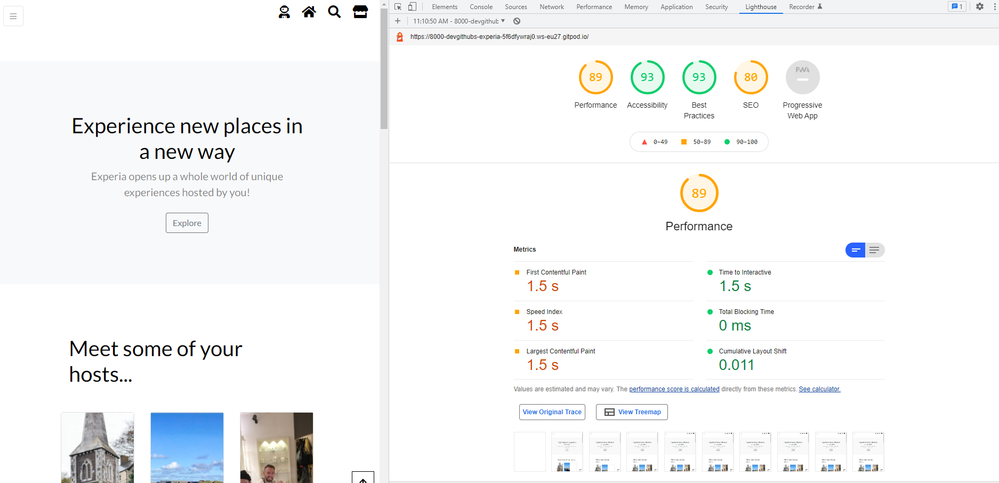
- Performance - 89/100
- Accessibility - 93/100
- Best Practices - 93/100
- SEO - 80/100

- Google Lighthouse - 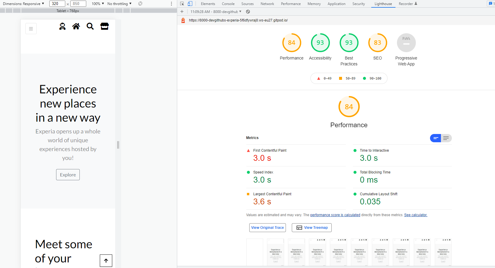
- Performance - 84/100
- Accessibility - 93/100
- Best Practices - 94/100
- SEO - 83/100

## User Stories
### View & Navigate

| User Story | 1                                                                                                                                |
|------------|----------------------------------------------------------------------------------------------------------------------------------|
| Test       | Navigating through the available experience/service, I chose the service ‘Forge a silver ring with Jewellers’, added to the bag. |
| Result     | I was able to look at multiple different experiences and had the option to add purchase                                          |
| Pass       | Satisfactory and positive results. All steps worked successfully.                                                                |

| User Story |  2                                                                                                                                                                                                                                          |
|-----------|---------------------------------------------------------------------------------------------------------------------------------------------------------------------------------------------------------------------------------------------------|
| Test      | Navigating through the website in the option Explore to identify the services, respective prices, description, rating availability and image.                                                                                                     |
| Result    | Opening each service I can identify a more detailed description of the service, what kind of service it is (e.g. sightseeing, art and culture, food and drink) and choose how many guests I will bring with me, to make a purchase for the group. |
| Pass      | Satisfactory and positive results. All steps worked successfully.                                                                                                                                                                                 |

| User Story | 3                                                                                                                     |
|------------|-----------------------------------------------------------------------------------------------------------------------|
| Test       | A promotion/coupon system was not implemented in this version of the app, currently featuring the range of services.  |
| Result     | It is planned for future development.                                                                                 |
| Pass       | Out of scope.                                                                                                         |

| User Story | 4                                                                                                                                                     |
|------------|-------------------------------------------------------------------------------------------------------------------------------------------------------|
| Test       | Access my order history and budget spent.                                                                                                             |
| Result     | Accessing my profile I can visualise my total purchases in the order history and the amount I have paid. I can access any information I want anytime. |
| Pass       | Satisfactory and positive results. All steps worked successfully.                                                                                     |

### Registration & user accounts

| User Story | 5                                                                                                                                                                                                                                                          |
|------------|------------------------------------------------------------------------------------------------------------------------------------------------------------------------------------------------------------------------------------------------------------|
| Test       | Register for an account.                                                                                                                                                                                                                                   |
| Result     | I registered for an account and received an e-mail with a link to confirm my e-mail address. Clicking on the link I was redirected to the website page to press the icon Confirm authorising my account. After that I could access my account and profile. |
| Pass       | Satisfactory and positive results. All steps worked successfully.                                                                                                                                                                                          |

| User Story | 6                                                                                                                                                                       |
|------------|-------------------------------------------------------------------------------------------------------------------------------------------------------------------------|
| Test       | Login and logout in my account                                                                                                                                          |
| Result     | Accessing the website I can log in with my email address and password at the top right corner, In the same location I can also logout with a confirmation to sign out.  |
| Pass       | Satisfactory and positive results. All steps worked successfully.                                                                                                       |

| User Story | 7                                                                                                                            |
|------------|------------------------------------------------------------------------------------------------------------------------------|
| Test       | I created an account, logged in and out, but forgot my password when I logged in again so selected the option reset password |
| Result     | I received the password reset link through my e-mail and reset my account password                                           |
| Pass       | Satisfactory results. The reset link received in my e-mail was sent straight away after selecting the option reset password. |

| User Story | 8                                                                                           |
|------------|---------------------------------------------------------------------------------------------|
| Test       | E-mail confirmation after registration.                                                     |
| Result     | After registering as a user I received an e-mail with a link to securely confirm my e-mail. |
| Pass       | Satisfactory and positive results. All steps worked successfully.                           |

| User Story | 9                                                                                                                                            |
|------------|----------------------------------------------------------------------------------------------------------------------------------------------|
| Test       | Personalised user profile.                                                                                                                   |
| Result     | In my profile I can visualise my order history, update and view my personal details and access each order individually through order number. |
| Pass       | Satisfactory and positive results. All steps worked successfully.                                                                            |

### Host an experience

| User Story | 10                                                                                                                                                                                                                                                                                                                                                                                                                                                         |
|------------|------------------------------------------------------------------------------------------------------------------------------------------------------------------------------------------------------------------------------------------------------------------------------------------------------------------------------------------------------------------------------------------------------------------------------------------------------------|
| Test       | Creating and hosting an experience                                                                                                                                                                                                                                                                                                                                                                                                                         |
| Result     | At the top of the website or at the Experia Icon (mobile) at the right corner I can select Host an experience and create and host my own experience, I fill out the form with experience name, description, Experience category, Location, Price, Duration and the host name. I also have the option to upload an image to feature my experience. I select the option Submit and I can visualise the experiences, where I can manage them edit and remove. |
| Pass       | Satisfactory and positive results. All steps worked successfully.                                                                                                                                                                                                                                                                                                                                                                                          |

| User Story | 11                                                                                                                                                                                                                                                  |
|------------|-----------------------------------------------------------------------------------------------------------------------------------------------------------------------------------------------------------------------------------------------------|
| Test       | Hosting my experience.                                                                                                                                                                                                                              |
| Result     | I created the many experiences selecting the Astronaut icon at the right corner Host an experience. In my hosted experiences I can edit or remove the experience. My Experience appears in the list of all Experiences, where anybody can purchase. |
| Pass       | Satisfactory and positive results. All steps worked successfully.                                                                                                                                                                                   |

### Sorting & searching

| User Story | 12                                                                                                                                           |
|------------|----------------------------------------------------------------------------------------------------------------------------------------------|
| Test       | Sort list of products/services                                                                                                               |
| Result     | Navigating to the Experiences page I can sort by price (low-high/high-low), rating (low-high/high-low), city (A-Z/Z-A) and all Experiences.  |
| Pass       | Satisfactory and positive results. All steps worked successfully.                                                                            |

| User Story | 13                                                                                                   |
|------------|------------------------------------------------------------------------------------------------------|
| Test       | Sort category of products/services                                                                   |
| Result     | Under the Host an Experience drop down, I was able to filter the different categories of Experiences |
| Pass       | Worked as expected                                                                                   |

| User Story | 14                                                                                                                                                                                                  |
|------------|-----------------------------------------------------------------------------------------------------------------------------------------------------------------------------------------------------|
| Test       | Sort multiple categories simultaneously.                                                                                                                                                            |
| Result     | In the search bar I can type key words to look for specific Experiences, when the Experience is found I can select the Sort by icon and sort those Experiences by price, rating, city and category. |
| Pass       | Satisfactory and positive results. All steps worked successfully.                                                                                                                                   |

| User Story | 15                                                                                                                                                        |
|------------|-----------------------------------------------------------------------------------------------------------------------------------------------------------|
| Test       | Search bar for product/service by name or description.                                                                                                    |
| Result     | In the search bar I can sort by city, key word or other description. When the description is not available appears a message 0 Experiences found for “…”. |
| Pass       | Satisfactory and positive results. All steps worked successfully.                                                                                         |

| User Story | 16                                                                                                                                                                                    |
|------------|---------------------------------------------------------------------------------------------------------------------------------------------------------------------------------------|
| Test       | What I’ve searched and number of results                                                                                                                                              |
| Result     | In the Search bar I can see the history of my searches.  When I type a key word and the Experience is found, the quantity of Experiences found appears above the Experiences results. |
| Pass       | Satisfactory and positive results. All steps worked successfully.                                                                                                                     |

| User Story | 17                                                                                                                                                                                                                                                                                                                                                                                  |
|------------|-------------------------------------------------------------------------------------------------------------------------------------------------------------------------------------------------------------------------------------------------------------------------------------------------------------------------------------------------------------------------------------|
| Test       | Making a wish list                                                                                                                                                                                                                                                                                                                                                                  |
| Result     | The heart icon is the wish list. I was drawn straight to it. I can select any Experience and click on the heart at the right top corner of the experience image, then appears an alert in the checkout icon confirming that the Experience is added to my wish list. I can also add from experiences detail page. All my selected favourited Experiences were on my Wish list page. |
| Pass       | Satisfactory and positive results. All steps worked successfully.                                                                                                                                                                                                                                                                                                                   |
### Purchase & checkout

| User Story | 18                                                                                                                                                                                                                                                                                               |
|------------|--------------------------------------------------------------------------------------------------------------------------------------------------------------------------------------------------------------------------------------------------------------------------------------------------|
| Test       | Updating the number of guests for an Experience dynamically.                                                                                                                                                                                                                                     |
| Result     | After selecting the experience, in the checkout I updated the number of guests from1 to 4, updated the number selecting Update icon which the price was also updated, then clicked Secure checkout. In the purchase section, the order summary appears with updated price and number of guests.  |
| Pass       | Satisfactory and positive results. All steps worked successfully.                                                                                                                                                                                                                                |

| User Story | 19                                                                                       |
|------------|------------------------------------------------------------------------------------------|
| Test       | View items in shopping bag                                                               |
| Result     | In the checkout area I can clearly see and identify the total cost before the purchase.  |
| Pass       | Satisfactory and positive results. All steps worked successfully.                        |

| User Story | 20                                                                                                                                                                  |
|------------|---------------------------------------------------------------------------------------------------------------------------------------------------------------------|
| Test       | Adjust quantity, date and time of Experiences in shopping bag.                                                                                                      |
| Result     | It is possible to adjust quantity of Experiences in checkout area but date and time are still not available, these option will be included in future developments.  |
| Pass       | Satisfactory and positive results. All steps worked successfully.                                                                                                   |

| User Story | 21                                                                                                                            |
|------------|-------------------------------------------------------------------------------------------------------------------------------|
| Test       | Enter my payment information.                                                                                                 |
| Result     | In the checkout I can easily fill the information and quickly complete the purchase with the Stripe test card number (42424). |
| Pass       | Satisfactory and positive results. All steps worked successfully.                                                             |

| User Story | 22                                                                                      |
|------------|-----------------------------------------------------------------------------------------|
| Test       | Processing safely payment information.                                                  |
| Result     | The checkout payment was processed by Stripe and I felt secure and safe with no hassle. |
| Pass       | Satisfactory and positive results. All steps worked successfully.                       |

| User Story | 23                                                                                                              |
|------------|-----------------------------------------------------------------------------------------------------------------|
| Test       | View order confirmation after checkout.                                                                         |
| Result     | After checkout I can double check order details on the confirmation page and through e-mail order confirmation. |
| Pass       | Satisfactory and positive results. All steps worked successfully.                                               |

| User Story | 24                                                                                                                                            |
|------------|-----------------------------------------------------------------------------------------------------------------------------------------------|
| Test       | E-mail confirmation after checkout.                                                                                                           |
| Result     | After purchasing the Experience I received an e-mail with order confirmation and details, that can be used for records and proof of purchase. |
| Pass       | Satisfactory and positive results. All steps worked successfully.                                                                             |

### Admin & store management

| User Story | 25                                                                                                                               |
|------------|----------------------------------------------------------------------------------------------------------------------------------|
| Test       | Add a product to store                                                                                                           |
| Result     | As an Admin I was easily able to add a new experience to the store via the Host form facility and also in the Django admin panel |
| Pass       | Satisfactory and positive results. All steps worked successfully.                                                                |

| User Story | 26                                                                                                                                           |
|------------|----------------------------------------------------------------------------------------------------------------------------------------------|
| Test       | Edit/update a product                                                                                                                        |
| Result     | As an Admin I was easily able to Change experience prices, descriptions, images etc. in the Host form facility and in the Django admin panel |
| Pass       | Satisfactory and positive results. All steps worked successfully.                                                                            |

| User Story | 27                                                                                                                                      |
|------------|-----------------------------------------------------------------------------------------------------------------------------------------|
| Test       | Edit/update a product                                                                                                                   |
| Result     | As an Admin I was easily able to Remove experiences that are no longer for sale in the Host form facility and in the Django admin panel |
| Pass       | Satisfactory and positive results. All steps worked successfully.                                                                       |

| User Story | 28                                                                                                                       |
|------------|--------------------------------------------------------------------------------------------------------------------------|
| Test       | Edit/update a review                                                                                                     |
| Result     | As an Admin I was able to Review a particular experience in the Experiences detail webpage and in the Django admin panel |
| Pass       | Satisfactory and positive results. All steps worked successfully.                                                        |

| User Story | 29                                                                                                                                                               |
|------------|------------------------------------------------------------------------------------------------------------------------------------------------------------------|
| Test       | Delete a review                                                                                                                                                  |
| Result     | As an Admin I was able to Delete a review that may be offensive or against the terms of the site in the Experiences detail webpage and in the Django admin panel |
| Pass       | Satisfactory and positive results. All steps worked successfully.                                                                                                |

## Bugs

- Issue: AWS S3 images were not being served after manual upload.
- Cause: On set up of the bucket the media file was at the wrong level of hierarchy. 
- Solution: Checked the bucket set up from the begining, eliminated each step until it was found that the url was not correct and fixed. Images loaded as expected

- Issue: CSRF token not from trusted source. Preventing form submission across website.
- Cause: Saw on Stackoverflow that the error can be caused when the POST request came from an untrusted source.
- Solution: Setting the CSRF_TRUSTED_ORIGINS = ['localhost'] eliminated the error.

- Issue: Noticed that the confirmation email from Stripe webhook was not clearing. Checked the Stipe dashboard and saw payment_intent.created and charge.succeeded webhooks were returning OK 200 responses but payment_intent.succeeded was showing 500 error with no response
- Cause: Mismatch in the variable name in the view request for the email field from the Order model 
- Solution: A tricky one to debug but when the function was targeting the correct model field it worked, payment_intent.succeeded = 200 OK and the confirmation email was sent to the email inbox.  

- Issue: Footer not staying at the bottom of some webpages.
- Cause: This usually occurs on pages when there is not enough content to push the footer down.
- Solution: Found a handy solution here: [Fix](https://radu.link/make-footer-stay-bottom-page-bootstrap/)
    - Step 1: Add these Bootstrap classes to the 'body' tag `d-flex flex-column min-vh-100`
    - Step 2: Add the `mt-auto` class to the 'footer' or wrapper if you use any.